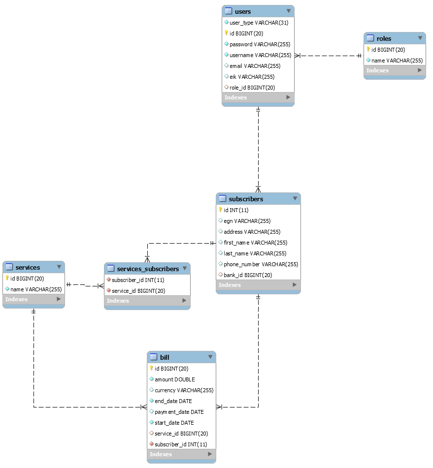

NGPuppies Project
This is the back-end part of the NGPuppies project developed by "The Thing" team (Iliana Darabanova and Mariya Iskrova) as a final project at the Telerik Academy. 
Used technologies: Java, SpringBoot, JPA, Hibernate.
Used rdbms: MySQL
Structre of the database: 

